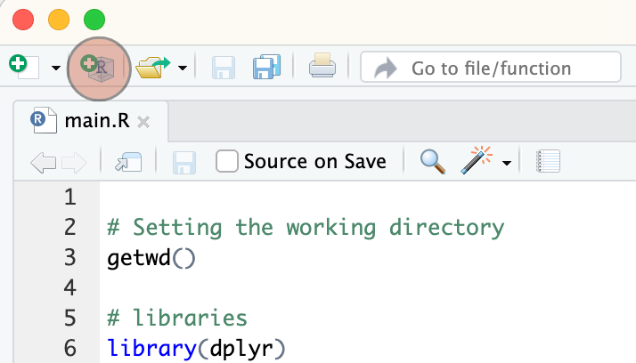
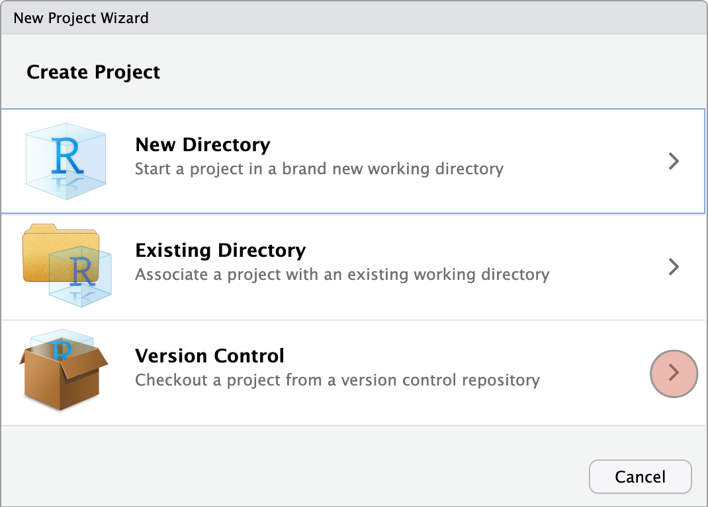
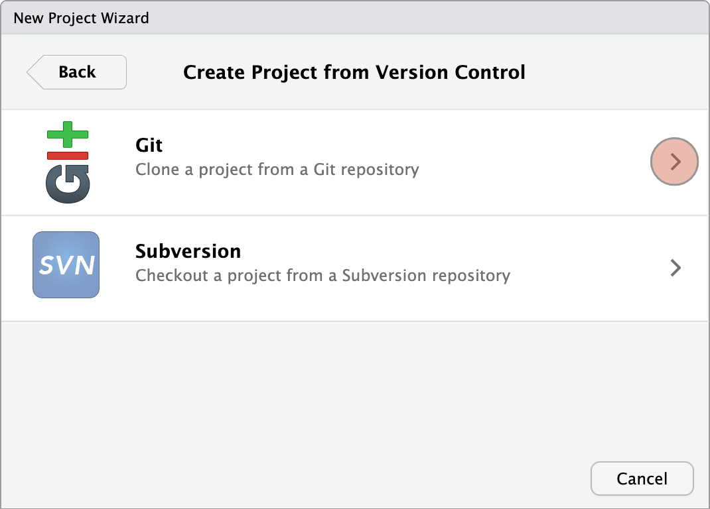
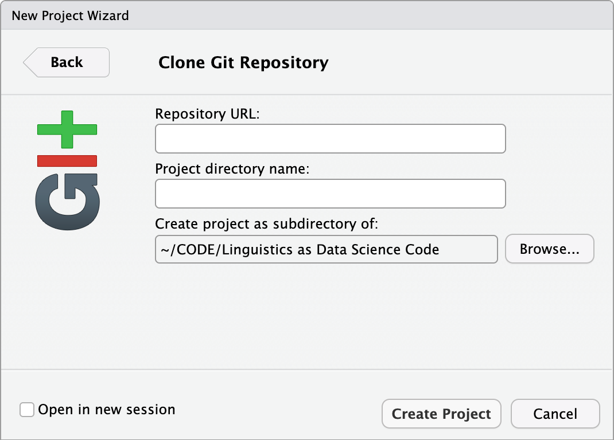
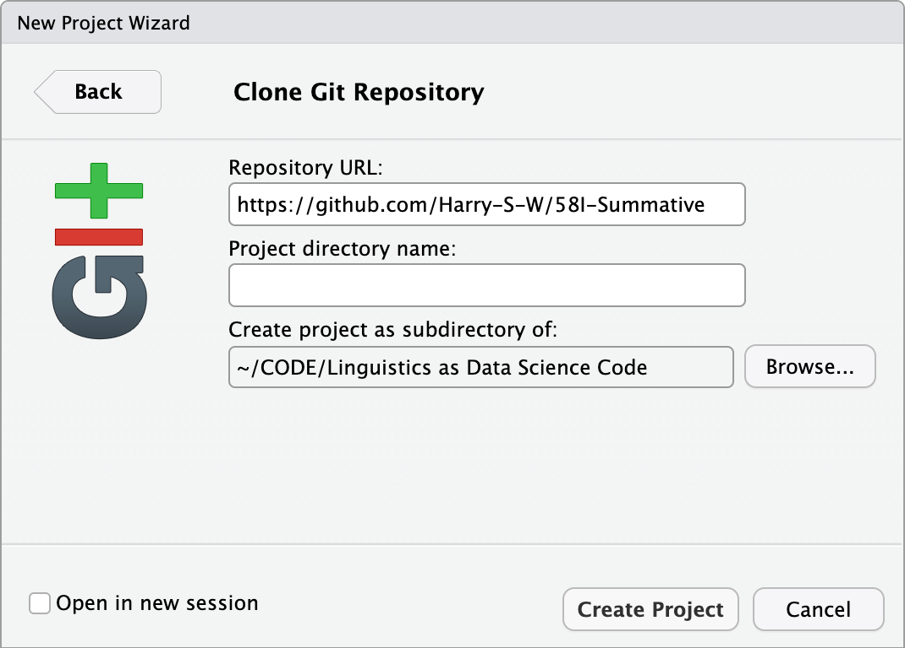
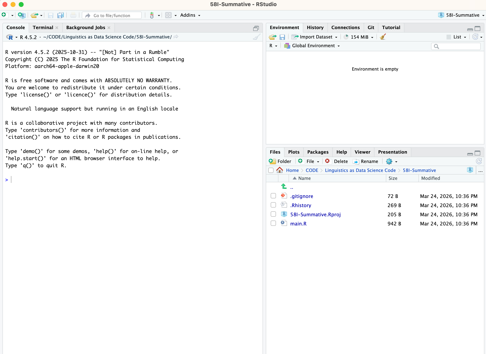

# 058I Summative Assessment

This file contains instructions on how to download this code and run it in R studio.

## Downloading this code into R:

### Step 1: Locating the create project button



When you open R studio, navigate to the top-left of the screen where you will see the "create project" button. This is highlighted in the image above. Press that button.

### Step 2: Choosing the right project



To let RStudio know you want to download code from somewhere on the internet, press "Version Control". You will then be prompted with two choices.

### Step 3: Git



Understanding what "version control" means is not very important. Just know that this code is on a service called "Git". Press the "Git" button.

### Step 4: Cloning the repository



Once you press "Git" in step 3, you will be prompted to paste the "Repository URL". The URL can be found below:

``` txt
https://github.com/Harry-S-W/58I-Summative
```

Paste that link into the "Repository URL" field. Your screen should now look like this:



It is important to also know where you are downloading this repository. You can see the location in the field "Create project as subdirectory of" which is the path you are downloading to. To change this, simply press the "Browse..." button and choose a file location.

### Step 5: Creating new project

Once you have completed the step above, press the "create new project" button. Your screen should now look like:



**main.R** is where you will find the code. However, you may notice there is no data. Follow the tutorial below to add the data.

## Downloading data into RStudio Project
